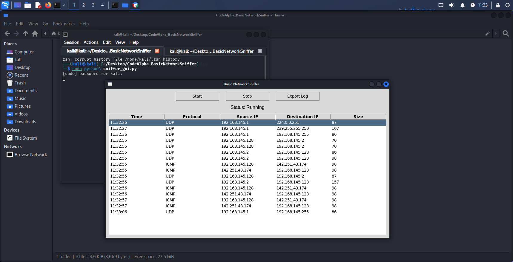

# CodeAlpha - Basic Network Sniffer

This project was created as part of the CodeAlpha Cyber Security Internship.

## Project Description

A GUI-based basic network sniffer developed in Python to capture and analyze live network packets.  
The application monitors network traffic and displays useful packet information in real time.

## Features

- Live packet sniffing
- Source IP and Destination IP detection
- Protocol identification (TCP / UDP / ICMP)
- Packet size monitoring
- Start / Stop controls
- Export packet logs
- GUI interface using Tkinter

## Environment

- OS: Kali Linux
- Virtualization: VMware Workstation
- Language: Python 3
- Libraries: Scapy, Tkinter

## Folder Structure

```text
CodeAlpha_BasicNetworkSniffer/
├── sniffer_gui.py
├── requirements.txt
├── README.md
├── screenshots/
│   └── app_preview.png
└── exported_logs/
    └── sample_log.txt
```


## Installation

Install dependency:

pip install scapy

Run project:

python3 sniffer_gui.py

## Screenshots

Application preview:



## Tested Environment

- Kali Linux (VMware Workstation)
- Windows 10/11

## Requirements

### Kali Linux

Install Scapy:

pip install scapy

### Windows

Install Scapy:

pip install scapy

Install Npcap for packet capturing:

https://npcap.com/#download

Enable:

- Install Npcap in WinPcap API-compatible mode

## Learning Outcomes

Through this project I learned:

- Packet structure
- IP addressing
- Network protocols
- Live traffic analysis
- GUI application development
- Packet logging

## Author

Anish Kumar Patel  
The British College Kathmandu                                                                                
Cyber Security and Digital Forensics
